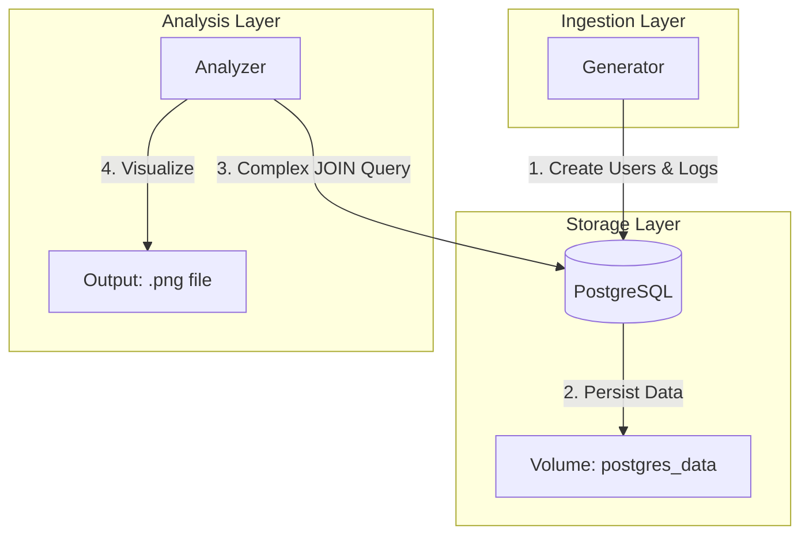

# 유저 이벤트 로그 파이프라인 구축

이 프로젝트는 **이커머스 서비스의 회원 등급별 행동 분석**을 가정한 데이터 파이프라인입니다.
가상의 유저(Gold/Silver/Bronze 등급)들이 생성하는 다양한 행동 로그를 수집하여 서비스를 개선하기 위한 과정을 나타냅니다.

### ⚙️ 파이프라인 흐름
1.  **이벤트 생성 (Generation)**: 가상 유저 생성 및 구매/페이지뷰 등 행동 로그 시뮬레이션
2.  **데이터 적재 (Storage)**: PostgreSQL RDBMS에 마스터 데이터와 로그 데이터를 관계형으로 저장
3.  **데이터 분석 (Analysis)**: SQL JOIN을 활용하여 등급별 매출 기여도 및 유입 채널 분석
4.  **시각화 (Output)**: 분석 결과를 차트(`output/*.png`)로 출력하여 시각적 리포트 생성

## 실행 방법

### 필수 도구
- Docker(Docker Desktop), Docker Compose

### 실행 단계
1. 프로젝트 루트 폴더에서 아래 명령어를 입력합니다.
   ```bash
   docker-compose up --build
   ```
2. 실행 후 자동으로 진행되는 과정:
   - `db`: `users` (마스터)와 `event_logs` (로그) 테이블 생성 및 관계(FK) 설정
   - `generator`: 20명의 가상 사용자를 먼저 생성한 후, 이들을 기반으로 500건의 이벤트 로그 적재
   - `analyzer`: **JOIN 쿼리**를 실행하여 멤버십 등급별 매출 기여도 등을 분석
3. 결과 확인: `output/rdbms_analysis.png` 파일에서 시각화 차트를 확인할 수 있습니다.

---
## 스키마 설명

### 저장소 선택: PostgreSQL
- **이유**: 단순 로그 적재를 넘어 사용자 정보와의 관계형 모델링을 완벽히 지원하며, 복잡한 JOIN 쿼리 성능이 뛰어나기 때문입니다.

```sql
-- 1. 사용자 정보 테이블 (마스터 데이터)
CREATE TABLE IF NOT EXISTS users (
    user_id          VARCHAR(100) PRIMARY KEY,
    name             VARCHAR(100),
    membership_level VARCHAR(20), -- 'Gold', 'Silver', 'Bronze'
    signup_date      TIMESTAMP DEFAULT CURRENT_TIMESTAMP
);

-- 2. 이벤트 로그 테이블 (트랜잭션 데이터)
CREATE TABLE IF NOT EXISTS event_logs (
    id             BIGSERIAL PRIMARY KEY,
    event_type     VARCHAR(50)  NOT NULL,
    user_id        VARCHAR(100) NOT NULL REFERENCES users(user_id), -- 외래키 설정
    session_id     VARCHAR(100) NOT NULL,
    event_time     TIMESTAMP    NOT NULL,
    page_url       VARCHAR(255),
    traffic_source VARCHAR(50),
    device_type    VARCHAR(20),
    properties     JSONB,
    created_at     TIMESTAMP DEFAULT NOW()
);

-- 인덱스 설정
CREATE INDEX IF NOT EXISTS idx_event_logs_user_id     ON event_logs (user_id);
CREATE INDEX IF NOT EXISTS idx_event_logs_event_type  ON event_logs (event_type);
CREATE INDEX IF NOT EXISTS idx_event_logs_event_time  ON event_logs (event_time);
```

데이터 중복을 방지하고 분석 효율을 높이기 위해 테이블을 두 개로 분리했습니다.

#### `users` (Master Data)
- 사용자의 고유 정보(이름, 멤버십 등급 등)를 관리합니다.
- 등급(`membership_level`): Gold, Silver, Bronze

#### `event_logs` (Transaction Data)
- 유저의 행동 로그를 기록하며, `user_id`를 통해 `users` 테이블과 관계를 맺습니다.
- **주요 필드**: `session_id`(흐름 분석), `traffic_source`(유입 경로), `properties`(JSONB를 활용한 가변 상세 정보)

### 설계 의도 및 장점
- **JOIN 활용**: 단순 통계를 넘어 "Gold 멤버십 유저가 가장 많이 유입되는 채널은 어디인가?"와 같은 고차원 분석이 가능합니다.
- **데이터 무결성**: 외래키(Foreign Key)를 통해 존재하지 않는 유저의 로그가 쌓이는 것을 방지합니다.

---
## 구현하면서 고민한 점

- **마스터와 로그의 동기화**: 로그(`event_logs`)는 반드시 유저(`users`)가 먼저 존재해야 적재 가능합니다. 따라서 Generator에서 유저 생성을 선행하고 트랜잭션을 커밋한 뒤 로그를 쌓도록 순서를 제어했습니다.
- **JSONB의 전략적 사용**: 공통 차원(기기, 소스)은 컬럼으로 빼서 인덱싱하고, 이벤트마다 구조가 다른 값(매출액, 에러 코드)은 JSONB에 담아 유연성을 확보했습니다.
- **BI 도구 확장성**: 현재는 PNG로 결과를 출력하지만, 이 스키마는 **Metabase**와 같은 BI 도구를 연결했을 때 진정한 파워를 발휘합니다. SQL만으로 등급별/채널별 교차 분석이 가능하기 때문입니다.
- **확장성 및 비동기 처리**: 현재는 전체적인 데이터 흐름을 직관적으로 보여주기 위해 **동기식(Synchronous)** 파이프라인으로 구성했습니다. 하지만 실제 대규모 서비스로 확장한다면 아래와 같은 비동기 아키텍처로의 전환을 고려할 수 있습니다:
    - **Message Queue 도입**: Generator와 DB 사이에 **Apache Kafka**나 **RabbitMQ**를 두어 Producer(생성)와 Consumer(저장)를 분리함으로써, 갑작스러운 트래픽 폭증에도 DB 부하를 제어할 수 있습니다.
    - **배치 처리의 분리**: 현재는 Generator가 직접 DB에 쓰지만, 로그를 S3 같은 Object Storage에 먼저 저장하고 이를 정기적으로 DB로 옮기는 **ETL(Extract-Transform-Load)** 프로세스로 확장하여 저장소 효율을 높일 수 있습니다.

---
## 이벤트 타입 설계

### 주요 이벤트 타입
1.  **`page_view`**: 사용자의 유입 소스(`traffic_source`)를 파악하여 어떤 채널이 가장 효과적인지 분석합니다.
2.  **`add_to_cart`**: 구매 의사가 있는 유저의 행동을 포착합니다. `properties` 필드에 담긴 상품 ID를 통해 인기 상품을 추적할 수 있습니다.
3.  **`purchase`**: **가장 중요한 비즈니스 지표**입니다. `users` 테이블의 멤버십 등급과 JOIN하여 "어떤 등급의 유저가 실제 매출에 가장 큰 기여를 하는지" 산출합니다.
4.  **`click`**: UI/UX 개선을 위한 기초 데이터로 활용됩니다.

### 설계 이유
-   **비즈니스 인사이트 추출**: 단순한 로그 적재가 아니라, 멤버십 등급(Gold/Silver/Bronze)이라는 **차원(Dimension)**과 매출액이라는 **측정값(Metric)**을 결합하여 실무에서 즉시 활용 가능한 '등급별 매출 리포트'를 생성하기 위함입니다.
-   **유연한 스키마 (JSONB)**: 모든 이벤트가 가진 공통 속성은 컬럼으로 분리하고, 상품 정보나 결제 상세 정보 등 이벤트마다 구조가 다른 값은 `properties` (JSONB) 컬럼에 저장하여 정규화의 이점과 유연성을 동시에 확보했습니다.

---
## 전체 아키텍처 (Local Environment)

현재 프로젝트는 Docker Compose를 통해 3개의 컨테이너가 유기적으로 작동합니다.



---

## Kubernetes 리소스 파일 작성 - 이벤트 생성기 앱

현재 작성된 이벤트 생성기 애플리케이션 (generator) 기준으로 다음과 같은 리소스 설정 파일을 작성하였습니다.
(k8s 폴더 참고)

1. generator-config.yaml (ConfigMap, Secret)
    - 역할 및 이유 : 환경 설정과 보안 정보를 코드에서 분리하여 운영 안정성을 확보했습니다.
2. generator-deployment.yaml
    - 역할 및 이유 : 24시간 중단 없이 실행되어야 하는 이벤트 생성기(사용자 행동
          시뮬레이터)를 관리합니다. 현업에서 실시간 장애 탐지나 실시간 재고 관리와 같은    
          **Hot Path** 처리를 위해서는 데이터가 들어오는 즉시 처리할 수 있는 상시 가동 서버가        
          필요합니다. `Deployment`는 이러한 실시간성을 보장하며, `replicas` 설정을 통해 트래픽       
          증가에 따른 수평 확장(Scaling)이 용이합니다. 따라서 이러한 가정을 두고 `Deployment`를 선택했습니다.

### 리소스 선택 시 고민했던 점
현재 이 프로젝트의 `generator`는 500개의 로그를 생성하고 종료되는 구조입니다.
    
- 한 번 실행하고 끝나는 스크립트인데, 왜 Deployment로 배포하는가?
    1.  시나리오의 차이
    `Job` (현재 프로젝트에 적합): "데이터 시딩(Seeding)"이나 "일회성 배치 작업"이라면 `Job`이 가장 정확한 선택입니다.
    `Deployment` (실제 현업에 적합): 만약 이 생성기가 실제 서비스를 모사하여 24시간 내내 실시간으로 사용자 로그를 쏘아주는 역할**을 한다면, 무한 루프를 도는 프로세스로 작성하여 `Deployment`로 관리해야 합니다. K8s가 해당 프로세스가 죽지 않도록 감시해주기 때문입니다.
    
    2.  학습 및 확장성 목적 
    본 프로젝트에서 `Deployment`를 선택한 이유는, 이 생성기를 나중에 "실시간 데이터 스트림 공급원"으로 확장할 것을 염두에 두었기 때문입니다. 현재는 500개만 쌓고 종료되지만, 실제 운영 환경의 입구(Ingestion) 역할을 수행하는 서버는 항상 켜져 있어야 하므로 `Deployment`의 동작 방식을 선택하는 것이 타당하다고 판단했습니다.

